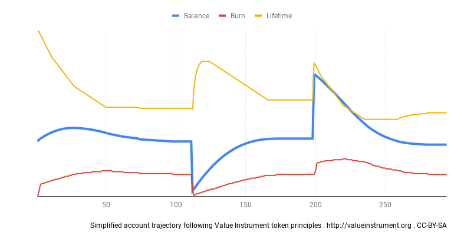

Value Instrument
==================
Token White Paper
==================
v0.2.6.1 Release  |  4th March 2019  |  hello@valueinstrument.org

Abstract
--------

The Value Instrument outlines four design principles for value accounting and establishes a system in which each setting is customizable according to the requirements of its user base. The principles themselves are technology-agnostic; however we believe their application will be most effective if paired with distributed ledger technology and smart contracts, using digital tokens. Depending on the design of each implementation, an established token may also be used as a form of money, likely complementary to other currencies in use.

The Value Instrument token design principles allow for highly flexible token creation for many individual use cases. They are open to be integrated into any Dapp, app, software or web-platform. This white paper discusses the token creation, their math and in which context those tokens may be specifically useful.

Contents
---------

**Prerequisites**

**Introduction to the Value Instrument**

**Principles behind Value Instrument**

        Network members may receive a regular token payout

        Tokens may decay, if not used

        Full lifetime is restored for transacted tokens

        A transaction fee may apply

**Creation of Value Instrument Tokens**

        Minting

        Use Cases & Edge Cases

        Demurrage

        Tethering

        Inflation Throttle

**What is Value Instrument going to address?**

**Calculations behind Value Instrument**

        On Chain Data Points

        Determine new Account Balance

        Determine new Account Time-To-Zero

        Set Time of Account Last Activity

        Easily Calculable Example

        Graphical Model

        Simplified Account Trajectory

**Further conceptual stubs regarding Value Instrument**

        Organizations

        Money Supply

        Basic Income

        No Debt

        Ecosystem

**Summary & Closing Notes**

Prerequisites
=============

The code developed by the initiators of the Value Instrument in direct relation to the presented concepts is released under the **Apache 2.0 licence** and the supporting material, including this document, is released under the** CC-BY-SA 4.0 International licence**.  \
The initiators to be credited, in order of surname, are **Anna Blume, Marc Griffiths, Hibryda, Yann Levreau and Philipe Achille Villiers**.

Contributing editor to this document is **Aleeza Howitt**.

This document requires the basic understanding of distributed ledgers and smart contracts, The in-depth discussion about these technologies lies outside of the scope of this document.

**Distributed ledgers** are lists of transactions that are replicated across a number of devices, rather than being stored on a central server. These ledgers have mechanisms to make it hard to change historical records. *

**Smart contracts** - in the world of distributed ledgers - are little programs that execute 'if this happens then do that', run and verified by many devices to ensure trustworthiness. If distributed ledgers give us distributed trustworthy storage, then smart contracts give us distributed trustworthy calculations. *

**Tokens** serve as the transaction units and are distributed to accounts of network members as the result of the smart contract's calculations. They can represent any asset in existence or account for any value created or even be a valuable asset in themselves.

_* Quoting in part Antony Lewis, bitsonblocks.net, as per 10th April 2017. Quotes under CC-BY-SA licence_

Introduction to the Value Instrument
=====================================

The Value Instrument outlines four design principles for value accounting and establishes a system in which each setting is customizable according to the requirements of its user base.  The principles themselves are technology-agnostic; however we believe their application will be most effective if paired with distributed ledger technology and smart contracts, using digital tokens. Depending on the design of each implementation, an established token may also be used as a form of money, likely complementary to other currencies in use.

Principles behind Value Instrument
===================================

The following marks the four settings upon which the network may set their core token dynamic using the Value Instrument. A token dynamic may be 'locked-in' or adjusted at any point, in line with embedded governance systems*.

1. **Network members may receive a regular token payout**

        The regular payout is a mechanism to distribute new tokens equally to all network members.

2. **Tokens may decay, if not used**

        Tokens may have a lifetime, during which they decay. The amount of tokens in an account diminishes (e.g. linearly) over the set lifetime in this case. See also Figure 1 below.

3. **Full lifetime is restored for transacted tokens**

        The lifetime is reset for tokens reaching the recipient's account. It would otherwise be unfavourable to the recipient to accept short-lasting tokens and tokens would become complicated in their use and valuation.

4. **A transaction fee may apply**

        A transaction fee can be set, which is useful to protect the system against ping-pong transfers to regain token lifetime.

_* further exploration of distributed governance is outside of the scope of this white paper_

Creation of Value Instrument Tokens
====================================

**Minting**

Tokens are minted in the following way:

    1. An initial balance can be minted into member accounts on signup
    2. A regular payout can be minted into all member accounts
    3. Tokens may directly be minted into accounts, e.g. a community fund

Further, the restored lifetime of transacted tokens results in more tokens in existence based on network transaction volume (not minting new tokens, but existing tokens' decay is prolonged).

**Use Cases & Edge Cases**

The use cases are manyfold and so is the token dynamic. A network of freelancers may use tokens as form of internal settlement and distribute 24 tokens each day to each member with a token lifetime on the shorter end of 180 days, to encourage higher velocity. A network of businesses may increase the lifetime for their settlement-system to 5 years, as they need more planning time. A rarely accessible resource could be managed with 1 token per month per user. There are edge cases in the settings that would resemble money as we know it today: i.e. if the system in place  has zero payout and/or the token lifetime is set to 100 years.

**Demurrage**

Tokens may be subject to a demurrage ("token lifetime"). The demurrage proposed by Value Instrument gradually reduces the member's account balances. Therefore it is likely to discourage the hoarding of tokens and instead to increase the velocity of economic activity within the network. It may further help to achieve a more efficient allocation of tokens across the network members, as all account balances are always driven back to their mean level (see also Figure 2 below).

**Tethering**

Tokens may be tethered to things in the real world. For example, a pool of value may correspond to a CCU pool registered under Australian Cooperative Law.

**Inflation Throttle**

Limits may be set on any increased total supply of the currency. For example, making the amount generated a function of the total number of tokens lost due to decay.

What is Value Instrument going to address?
==========================================

The prime response to why an activity results in a struggle or is often _not even possible to achieve_, is that "there is no money", followed by "there is not enough money", followed by  \
"I don't have time, because I have to work two jobs to get the money I need to pay my rent". May it be the purchase of healthy food or the renovation of a building or the creation of a new public park: a struggle, a luxury, not possible. In many communities around the world the effects of this deprivation are felt extremely harshly and these challenging conditions are increasing for communities around the globe, in underdeveloped and developed countries alike, leading to an unhealthy life, social unrest, economic stress and ecological disaster.

Value Instrument addresses the deprivation of the means for exchange, offers a solution where reliable stores of value do not exist and provides technology to account for assets, products and services. Hence it offers to supplement existing systems and provides more choice, which is especially useful in situations where traditional money does not reach.

The rise of distributed ledger technology and its first application, the Bitcoin, have proven that the system of money-creation through the state and the promise of the state to protect the system can be changed or supplemented. It must not only be the state that can issue and control money. It can be issued by a smaller community and even an individual, making it technologically just as safe, if not safer. Another invention in distributed ledger technology that goes beyond beyond Bitcoin is the 'smart contract'.

With those technologies readily available now, a community can create 'programmable units of account' and distribute these directly to their peers, according to their own rules and governance structures, via the creation of dedicated tokens. Communities add more choice to the available mechanisms that drive their economic development. This increases their network resilience.

Such distribution does not exclude the use of fiat currency, which is guided by other rules, most often issued by a state. In fact, the opposite is likely to be the case. A complementary currency, as proposed in this paper, can supplement the limited systems we have now, unleashing the slumbering potential of those that are missing the means to create value.

Value Instrument Calculations
==============================

On Chain Data Points
--------------------

The following three data points are stored on-chain:

    1. Account Balance
    2. Balance's Time-To-Zero
    3. Time of Last Account Activity (block of last transaction)

Each transaction writes a new set of these three data points into the chain for the sender and recipient.

Blocks are used as sequential time measure.

The following explains how the new set is calculated.

Determine new Account Balance (a)
----------------------------------

**Determine the momentary decayed account balance first**

In the moment a new transaction is executed, the stored On-Chain Account Balances of sender and recipient will have decayed some of their stored amounts. The decayed amount is not shown on-chain, the on-chain data is somewhat "out of date". When calculating the new Account Balances to be written into the new sets, we have to first determine the "actual" account balance for that moment.

    Decayed Account Balance = On-Chain Account Balance - ( On-Chain Account Balance /  (On-Chain Account Balance Time-To-Zero  / ( New Transaction Time - Time of last account activity ) )* )

**Update Sender**

    New Sender Account Balance = Decayed Sender Account Balance - Sent Amount - Transaction Fee**

**Update Recipient**

    New Recipient Account Balance = Decayed Recipient Account Balance + Received Amount

_* given linear decaying behavior
** a system setting set and governed by the network, burned on transaction or partly credited to a community account_

Determine new Account Time-To-Zero (b)
--------------------------------------

When a new transaction happens, the Account Time-To-Zero, stored on-chain, of sender and recipient have to be updated. This is easy for the sender account: we just subtract the time passed from the time stored.

For the recipient, the calculation is a little more advanced. Here we take into account that the recipient has an account balance with a lifetime, both being zero or higher, and receives the incoming amount with full life time. Both lifetimes are now calculated into one new total lifetime, given their weight*, according to the Decayed Account Balance and new transaction amount.

**Recipient**

    New Recipient Account Time-To-Zero = ( Last Recipient Account Activity + Recipient Account Time-To-Zero - New Transaction Time ) * ( Decayed Recipient Account Balance / New Recipient Account Balance ) + Full Token Lifetime * ( Received Amount / New Recipient Account Balance )

**Sender**

    New Sender Account Time-To-Zero = Sender last Account Activity + Sender Account Time-To-Zero - New Transaction Time

_* alternatively the Recipient Account Time-To-Zero is not weighted, because it has been subject to decay already._

Set Time of Account Last Activity (c)
---------------------------------------

When a new transaction happens, the stored on-chain Time of the last account activity of sender and recipient have to be updated to the time of the transaction.

    New Sender Last Account Activity = New Recipient Last Account Activity = Moment of Transaction

Easily Calculable Example
--------------------------

Token lifetime is set to 50,000 blocks

An initial balance of 1000 V is credited to Paul at block 150,000.

Paul then receives 100 V at block 160,000.

The new data set of Paul calculates as follows:

(a)

    Decayed Recipient Account Balance = 1000 V - ( 1000 V /  (50,000 Blocks / ( 160,000 Blocks - 150,000 Blocks ) ) ) = 800 V

    New Recipient Account Balance = 800 V + 100 V = 900 V

(b)

    New Recipient Account Time-To-Zero = ( 150,000 Blocks + 50,000 Blocks - 160,000 Blocks ) * ( 800 V / 900 V ) + 50,000 Blocks * ( 100 V / 900 V )  = 40,000 * 8/9 + 50,000 * 1/9 = 35,555 + 5,555 = 41110 Blocks

(c)

    New Recipient Last Account Activity = Block 160,000

Expressed as JSON object: {  balance: 900, timeToZero: 41110, lastMove: 160000 }

Graphical Model of Calculations
-------------------------------

**Figure 1**

Figure 1 demonstrates visually, how the account balance's lifetime extends forward with each incoming transaction.

Simplified Account Trajectory Example
--------------------------------------

**Figure 2**

In Figure 2 a trajectory of an account is displayed, which is credited with 600 V initially and receives a regular payout of 24 V per day. Tokens have 120 days lifetime in this example. The account lays dormant or a while, then transfers 550 out, is dormant for a while again and then receives 700. This example demonstrates how an account always 'gravitates' to its mean and - given these specific token settings - never reduces to zero or below.

Further conceptual stubs regarding Value Instrument
===================================================

**Organizations**

It appears that a certain amount of non-anonymity is required to secure the system against sybil attacks. Value Instrument revolves around organizations as "trusted networks". An organization issues the wallets to members and therefore creates a network and can also revoke memberships. Setting up this system through organizations is a security mechanism.

Organizations, such as a coworking space community or a company, have real-life interactions that authenticate members simply on a human level and even without official other documents (like passports). This becomes a _decentralized_ network of organizations with members who are able to exchange using tokens in a _distributed_ way.

The choice of which identity solution will be used is in the hands of the community. We provide a default, which can be changed anytime, as per the defined governance process. An identities contract, maps from address to approved, and can act as a proxy to experiment with different identity solutions. This is a crucial and difficult part to get right.

**Money Supply**

The circulating tokens match the economic activity within the system. Newly issued tokens acts as an ignition to facilitate new exchanges. They either get used and carried on, or decay. The amount of tokens in the system therefore automatically increases and decreases depending on the number of network members and their transaction volume.

**Basic Income aspects**

The first principle of the Value Instrument allows for a regular payout, which resembles concepts around basic income for participants in of a network. The payout dynamic is primarily a way to get "spending money" to people, to provide an ignition. This is counteracted by the demurrage, which discourages hoarding and addresses inflation.

**No Debt**

Value Instrument supports the idea of "no debt", as no negative amounts can occur. It basically means that within the concept of Value Instrument an account cannot go below 0 and be "deemable". A member of an organisation could still lend tokens to others in a agreement including interest, but "out of chain" not inside. What happens outside is a business of people participating. There is no way to effectively manage any debt within Value Instrument. Important is that there is no support for "reversed" tokens (negative) that would mean a debt to be paid upon next iteration.

**Ecosystem**

The Value Instruments principles integrate into an ecosystem of activities in the field of cryptocurrencies, that address many issues and concepts mentioned in this paper. We name a few here that are placed in the Ethereum ecosystem in order to provide a broader view on the topics and an outlook for integrations.This list is by no means complete.

    Aragon - Organizational models and Governance

    Bancor Protocol - Token exchange

    Bright ID - Unique Identification

    DAO Stack - Organizational models

Summary & Closing Notes
=======================

The Value Instrument token design principles allow for highly flexible token creation for many individual use cases. They are open to be integrated into any Dapp, app, software or web-platform. This white paper discusses the token creation, their math and in which context those tokens may be specifically useful. Further important concepts have to be explored, that lie outside the scope of this paper, such as governance models for such tokens, digital unique identity, technological scaling, adoption, regulatory frameworks and the effects of such token on society and ethics.
